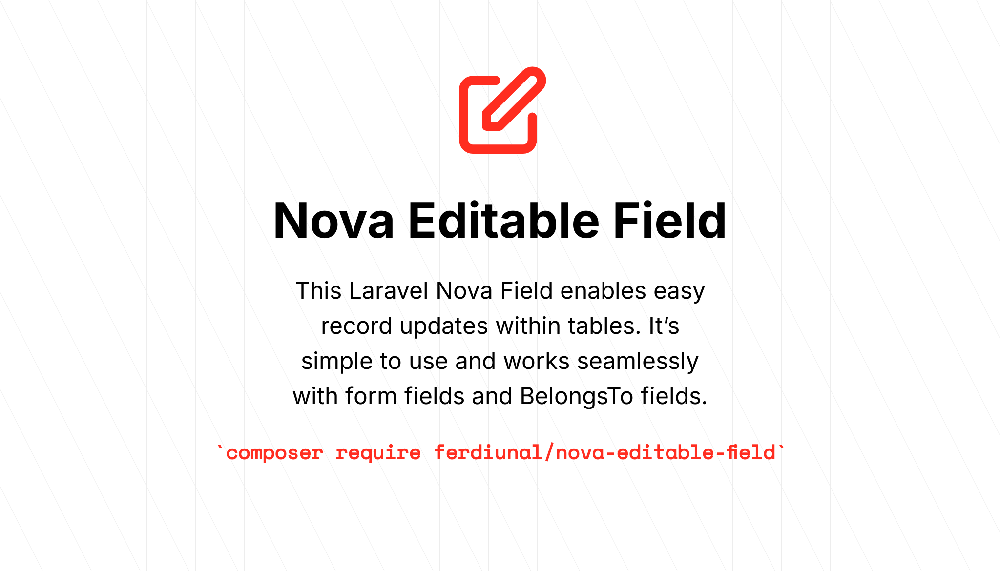
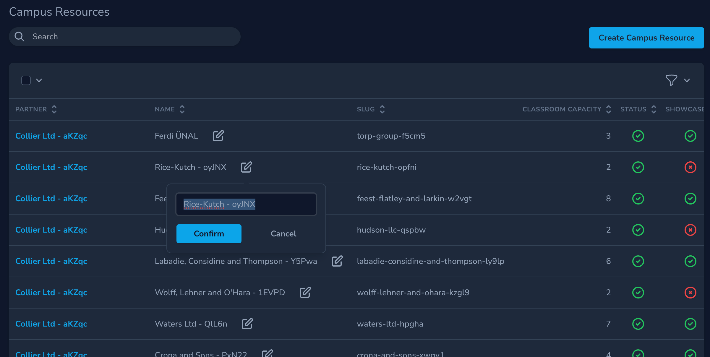
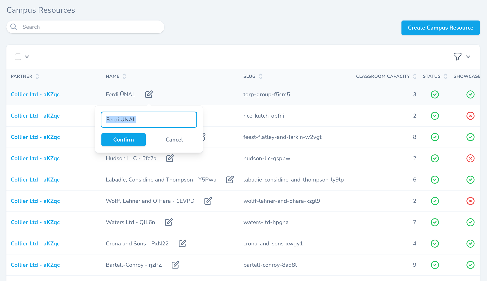
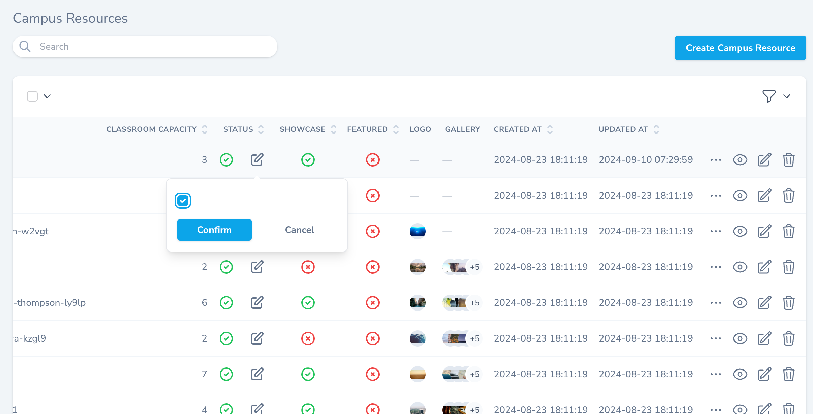
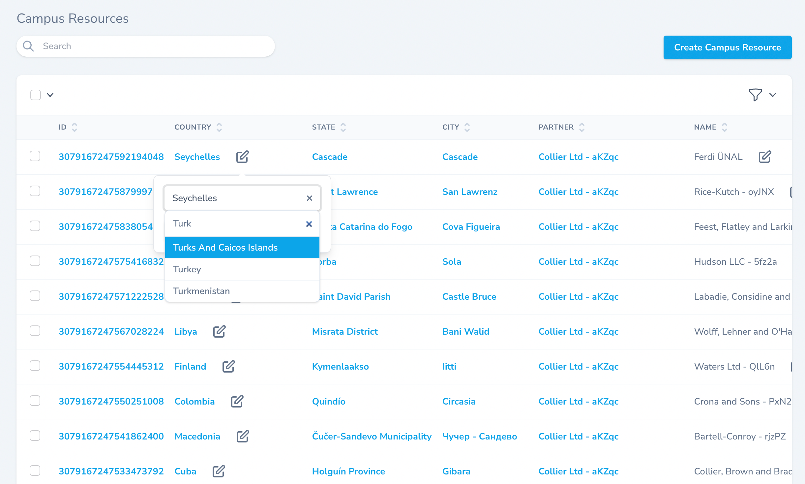
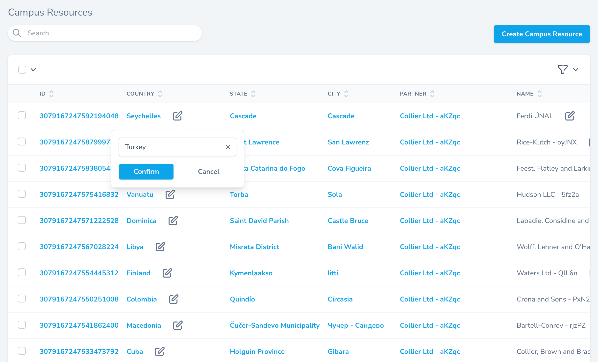

# Nova Editable Field

The purpose of this Laravel Nova Field is to allow easy updates to records within tables (development and testing for the Detail view are still in progress). So far, I haven't tested it with third-party components. It's very easy to use and can be seamlessly integrated with form fields and BelongsTo fields.

## Installation

```bash
composer require ferdiunal/nova-editable-field
```

## Usage

It is very easy to use, the first parameter is NovaRequest, the second one allows us to dynamically change the width of the Popover.

```php
<?php

namespace App\Nova;

use Illuminate\Http\Request;
use Laravel\Nova\Fields\Email;
use Laravel\Nova\Fields\Gravatar;
use Laravel\Nova\Fields\ID;
use Laravel\Nova\Fields\Text;
use Laravel\Nova\Http\Requests\NovaRequest;

class User extends Resource
{
    /**
     * The model the resource corresponds to.
     *
     * @var class-string<\App\Models\User>
     */
    public static $model = \App\Models\User::class;

    /**
     * The single value that should be used to represent the resource when being displayed.
     *
     * @var string
     */
    public static $title = 'name';

    /**
     * The columns that should be searched.
     *
     * @var array
     */
    public static $search = [
        'id', 'name', 'email',
    ];

    /**
     * Get the fields displayed by the resource.
     *
     * @return array
     */
    public function fields(NovaRequest $request)
    {
        return [
            ID::make()->sortable()->hideFromIndex(),
            Gravatar::make()->maxWidth(50),
            Text::make('Name')
                ->sortable()
                ->maxlength(255)
                ->enforceMaxlength()
                ->rules('required', 'max:255')
                ->editable($request, '300px'),
            Email::make('Email')
                ->sortable()
                ->rules('required', 'email', 'max:254')
                ->maxlength(254)
                ->enforceMaxlength()
                ->creationRules('unique:users,email')
                ->updateRules('unique:users,email,{{resourceId}}')
                ->editable($request),
        ];
    }
}

```

## Screenshots







License This package is open-sourced software licensed under the [MIT license](LICENSE).